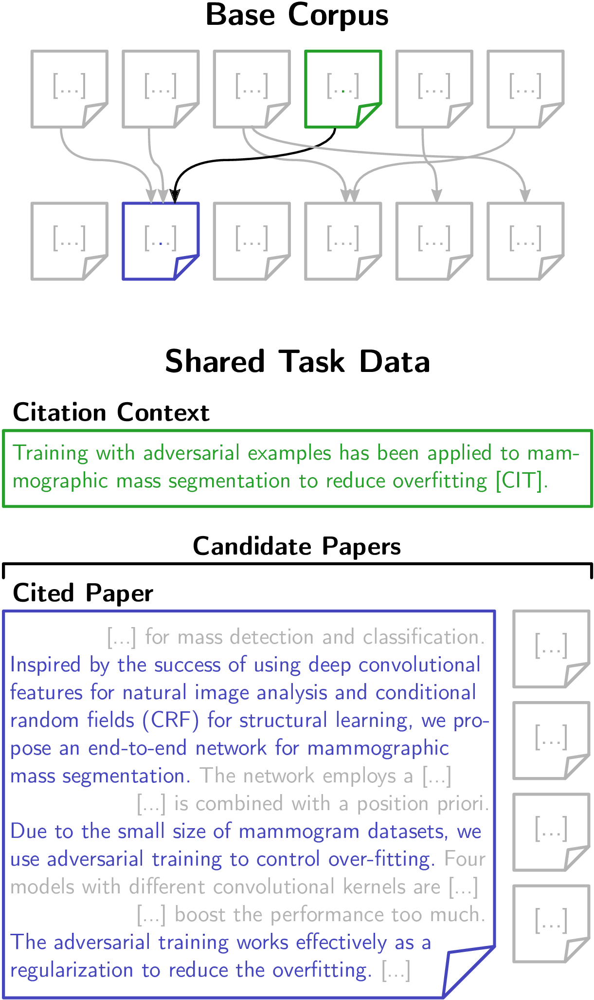
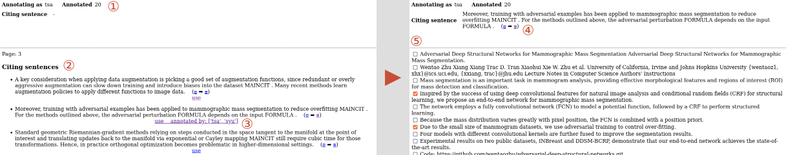

# Claim-based Citation Recommendation

Citation recommendation refers to the task of recommending appropriate citations for a text passage within a document. Although dozens of approaches to citation recommendation have been proposed, they actually do not consider the semantics of the claims to be backed up. In this proposed shared task, we propose the task which given an input claim consists of finding the text passages in other documents that match with the input claim. We will provide a novel dataset consisting of scientific publications' fulltexts. The task and the approaches to be developed will pave the way toward a new generation of citation recommendation, and will promote research concerning natural language processing (e.g., claim extraction), knowledge representation (e.g., claim-centric knowledge graphs), and machine learning.

## Annotation

For efficient data annotation we implemented a web based annotation UI.

The UI has the following features.

1. Annotators see how much they already annotated.
2. A list of citing sentences is displayed from which the annotator chooses those that contain a claim.
3. For each citing sentence it is displayed who already annotated it.
4. After selecting a citing sentence, the sentence itself is constantly displayed on top for reference.
5. Displayed below are the sentences of the cited paper, from which the annotator chooses those that back the claim.

## Experiments

We implemented basic experiments based on 20 annotated citation context. 

Approach: 
1. Extracting the representation of citation context and all the cited sentences from a pre-trained language model, e.g.: BERT, DistilBERT, RoBERTa. 
2. Calculating the cosine similarity between citation context and cited sentences.
3. Based on manual inspection, defining a threshold for the
    cosine similarity (we defined 0.90), above which a sentence will be predicted as
    positive.
   
4. Calculating Prec/Rec/F1 based on the binary predicted labels and
    our ground truth.
   
The code can be found [here](/experiments/calculate_cosine_similarity.ipynb).

### Data
Data used in the experiments:

[Annotation agreement of 20 citation context](/experiments/data/annotations_agreement_20.json)

[Cited papers](/experiments/data/cited_papers_20.json)

Cosine similarity between citation context and cited sentences by:
+ [BERT](/experiments/data/context_and_score_bert.json)

+ [DistilBERT](/experiments/data/context_and_score_distilbert.json)

+ [RoBERTa](/experiments/data/context_and_score_roberta.json)

+ [BERT: pretrained with 20 cited papers](/experiments/data/context_and_score_bert_pre-trained.json) (pretrained using the`run_mlm.py`script provided by [huggingface](https://github.com/huggingface/transformers/blob/main/examples/pytorch/language-modeling/run_mlm.py))

### Results
The preliminary results of the experiments:

*.csv: The cosine similarity of citation context and each cited sentences (ranked by cosine similarity).

*.png: The Prec/Rec/F1 based on the binary predicted labels and
    our ground truth.

